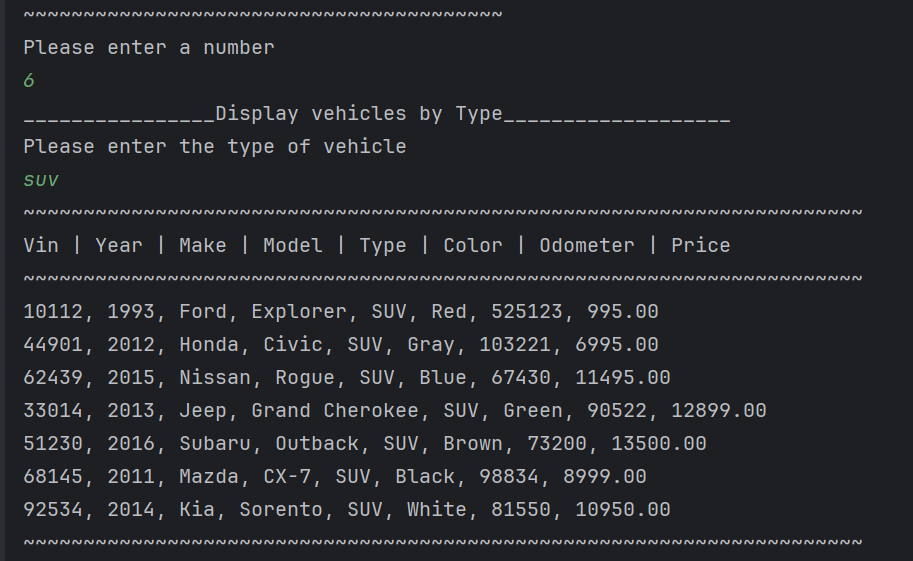

_______________________
# Car Dealership
_______________________
## This is a console based app that enables car salesperson or managers to manage and keep track of the vehicles. It also allows the users to filter the vehicles by various categories as well as add or remove vehicles of their choice.
________________________
# *Features*

- Error Handling
- CSV File Handling
- Console IO
- Filter Vehicles by Categories
- List All Vehicles
- Add Vehicle
- Remove Vehicle
___________________________________
# *Interesting Code*

        private ArrayList<Vehicle> inventory;

    public Dealership(String name, String address, String phone) {
        this.name = name;
        this.address = address;
        this.phone = phone;
        this.inventory = new ArrayList<>();

    }
This is the most interesting code in this program to me. Inside the constructor, we create a new, empty ArrayList and assigns it to inventory. I had never seen that being done before and it was different than our ususal initialization.
_______________________________________________
# Screenshots
### Main Menu

____________________________________________

### Filter by Price

________________________________________________
### Filter by Make/Model

________________________________________________
### Filter by Year

__________________________________________________
### Filter by Color

_________________________________________________
### Filter by Mileage

_________________________________________________
### Filter by Vehicle Type

_________________________________________________
### All Vehicles

___________________________________________________
### Add Vehicle

_____________________________________________________
### Remove Vehicle

### Exit Program
